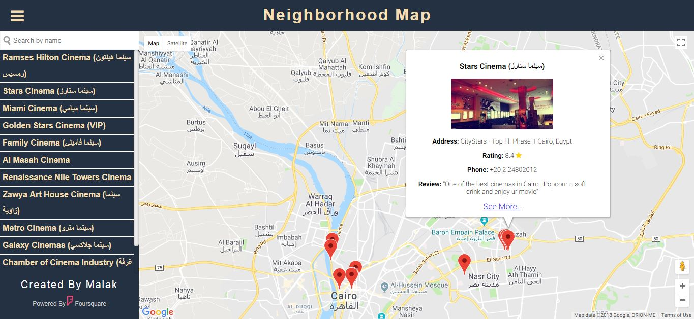

# Neighborhood Map

## Table of Contents
* [About the Project](#about-the-project)
* [Steps to run the Project](#steps-to-run-the-project)
  * [Prerequisites](#prerequisites)
  * [Installing The Project in ***Development Mode***](#installing-the-project-in-development-mode)
  * [Installing The Project in ***Production Mode***](#installing-the-project-in-production-mode)
  * [Live Demo](#live-demo)
* [Credits](#credits)
* [License](#license)

### About the Project
* This is the 8th and final project within the Udacity Nanodegree program.
* Project was created from scratch with `create-react-app`
* The project aims to make the user able to find prespecified locations on a map (***12 Egypt's cinemas from a center point: {lat:30.029860, lng:31.261105} within 10000km as a radius***).
* Map generated by a package `google-maps-react` which imports `Google Maps API` to load the map through `GoogleApiWrapper`.
* Details on each marker are fetched as a response requested from `Four Sqaure` as a third-party API.
* Used details are consists of (Title, Photo, Rating, Phone, Review and a URL to the page of the location requested with more information)
* List view on the left contains locations titles which connected to the marker information. A click event triggers with location's details displayed on the infoWindow.
* The search box is filtering the locations by written letters as the regexp does.
* Accessibility, Responsivness and Offline mode are counted to maximize the user experience.

### Steps to Run The Project
#### Prerequisites
1. Install [Node](https://nodejs.org/en/).
2. npm is bundled with node.

#### Installing The Project in ***Development Mode***
1. Use `Node.js command prompt`.
2. Clone the repository with `git clone https://github.com/MalakJoseph/my-reads-app`.
3. Go to the app directory `cd my-reads-app`.
4. Run `npm install` to install scripts and dependencies of the project.
5. Lastly, run `npm start` to have the project running on `http://localhost:3000/`.
6. ***Enjoy***.

***NOTE:*** *The service workers for this app will only cache the site when it is in production mode.*

#### Installing The Project in ***Production Mode***
1. Run `npm run build` to create a build version of the app
2. Install serve by `npm install -g serve`
3. Use `serve -s build` to serve the app on [http://localhost:5000](http://localhost:5000).

#### Live Demo
You can visit it [here](https://malakjoseph.github.io/neighborhood-map/)

### Credits
* [create-react-app](https://github.com/facebook/create-react-app)
* [GoogleMapsAPI](https://cloud.google.com/maps-platform/)
* [Foursqaure](https://foursquare.com/)
* [google-maps-react](https://github.com/fullstackreact/google-maps-react)

### License
This project is licensed under the terms of the MIT license.